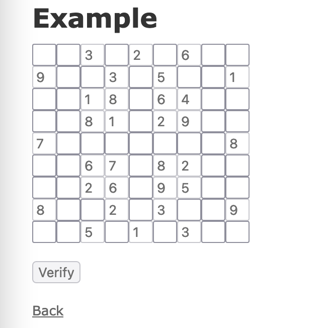

# MAK IT uzdevums

## Uzdevumi

1. Izveidot validāciju sudoku mīklām pie to izveides, kas pārbauda, vai iesniegtā sudoku mīkla ir derīga.

    Sudoku mīkla ir derīga, ja:

    1. tā ir nepabeigta;
    2. tās katrā rindā neatkārtojas cipari;
    3. tās katrā kolonnā neatkārtojas cipari;
    4. katrā apakšgrupā (deviņi mazie 3x3 kvadrātiņi) katrs cipars ir sastopams tikai vienreiz.

    Ievades faila piemērs:

    ```
      003020600
      900305001
      001806400
      008102900
      700000008
      006708200
      002609500
      800203009
      005010300
    ```

2. Papildināt `puzzles#show` skatu un pievienot `input` laukus lai lietotājs varētu mēģināt aizpildīt sudoku mīklu.

    Piemērs kā tas varētu izskatīties:

    

    Šo mēģinājumu nevajag saglabāt datu bāzē, bet ir nepieciešams ļaut iesniegt risinājumu un pārbaudīt tā pareizību.

    Sudoku mīkla ir pareizi aizpildīta, ja:

    1. tā ir pabeigta;
    2. tās katrā rindā neatkārtojas cipari;
    3. tās katrā kolonnā neatkārtojas cipari;
    4. katrā apakšgrupā (deviņi mazie 3x3 kvadrātiņi) katrs cipars ir sastopams tikai vienreiz.

    Šim uzdevumam var izmantot gan javascript risinājumu ar asinhronu pieprasījuma nosūtīšanu, gan vienkāršu `POST` pieprasījumu
